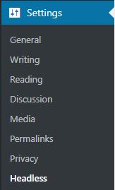
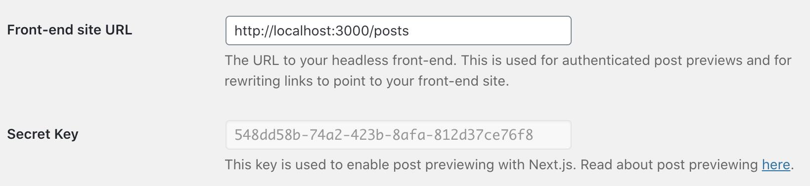

# Previews in Headless WordPress

**NOTE: This is prerelease software. As we work towards our first release, we will 💯 introduce breaking changes.**

In this guide, we'll walk through how to configure a Next.js site for previews.

## WPE Headless Plugin

In order to enable previews in WordPress, you'll first need to install the [wpe-headless plugin](../../plugins).

The plugin enables an OAuth flow for users to authenticate with WordPress and receive an access token which is used for subsequent API calls (i.e. GQL/REST).

In addition, the plugin will rewrite URLs in WordPress so that when a user clicks view/preview on a post, they will be taken to the frontend rather than WP.

### Plugin Settings

Go to Settings->Headless to view the plugin's settings page:



There are 2 settings that assist in previews. The first one is read-only. It gives you an API secret key that you need to use on your backend for your frontend.

The second setting is the location of your frontend. You'll need to put the base URL (i.e. http://localhost:3000).



## @wpengine/headless

The `@wpengine/headless` package provides helpers to get previews working in a React application.

Install the npm package via:

```
npm i @wpengine/headless
```

The package contains an auth handler to get an access token for a user when trying to view a preview/draft post as well as React hooks to pull post(s).

### Authorization Flow

In order to submit secure requests to WordPress, we need to be able to verify that a user has access to the content that is being requested. The plugin exposes routes that allow us to create access codes and exchange them for access tokens.

The flow looks like this:

-   User makes a request to a secure route (i.e. draft post)
-   User is redirected to WordPress to login
-   WordPress redirects back to frontend with a temporary code
-   The frontend server exchanges the code for an access token
-   The access token is stored in a cookie
-   The user is finally redirected back to the original Url and uses the access token in the cookie to make the authenticated request
