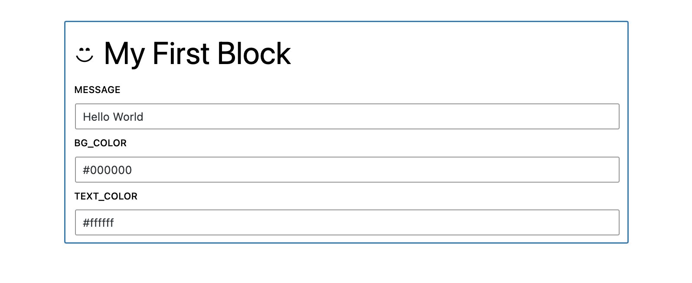
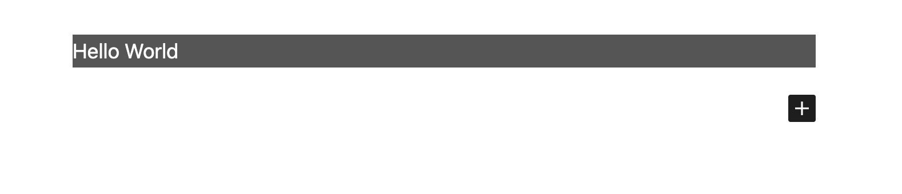

# @faustwp/block-editor-utils

<p align="center">
  <a aria-label="NPM version" href="https://www.npmjs.com/package/@faustwp/block-editor-utils">
    
  </a>

  <a aria-label="License" href="https://github.com/wpengine/faustjs/blob/canary/LICENSE">
    
  </a>
</p>

<p align="center">
  <a aria-label="Faust.js block-editor-utils Downloads Per Month" href="https://www.npmjs.com/package/@faustwp/block-editor-utils">
    
  </a>
  <a aria-label="Faust.js block-editor-utils Downloads Per Week" href="https://www.npmjs.com/package/@faustwp/block-editor-utils">
    
  </a>
</p>

`@faustwp/block-editor-utils` provides helper functions to convert React Components into Gutenberg Blocks.

## What is the big picture?

WordPress powers a significant portion of the web, and React is a popular library for building user interfaces. Converting React components into Gutenberg blocks will enable developers to utilize the power of React in WordPress development. This approach will also make it easier to keep the code DRY (Don't Repeat Yourself) and maintain a consistent UI across different parts of a WordPress site.

This package exposes a helper function that you can use to register a React Component in place of the [registerBlockType](https://developer.wordpress.org/block-editor/reference-guides/block-api/block-registration/#registerblocktype). It will facilitate some features for you without providing a custom `edit` or `save` functions. More details in the next section.

## How to get started?

Here are the quick steps needed to use this package:

1. From your root folder, install the required dependencies:
```bash
$ npm install @wordpress/scripts @faustwp/block-editor-utils --save-dev
```

2. Put your React Component inside `wp-blocks` folder. Here is an example using `wp-blocks/my-first-block` folder:

```jsx
// MyFirstBlock.jsx
function MyFirstBlock({ style, className, attributes, children, ...props }) {
    const styles = {
      ...style,
    };
    const cssClassName = 'create-block-my-first-block';
	return (
		<div
			style={styles}
			className={cssClassName}
			dangerouslySetInnerHTML={{ __html: attributes.message }}
		/>
	);
}

export default MyFirstBlock
```

2. Create an associated block.json file:

```json
{
	"$schema": "https://schemas.wp.org/trunk/block.json",
	"apiVersion": 2,
	"name": "create-block/my-first-block",
	"version": "0.1.0",
	"title": "My First Block",
	"category": "widgets",
	"icon": "smiley",
	"description": "Example block scaffolded with Create Block tool.",
	"supports": {
		"html": false
	},
	"attributes": {
		"message": {
			"type": "string",
            "default": "My First Block"
		},
		"bg_color": { "type": "string", "default": "#000000" },
        "text_color": { "type": "string", "default": "#ffffff" }
	},
	"textdomain": "my-first-block",
	"editorScript": "file:./index.js",
	"editorStyle": "file:./index.css",
	"style": "file:./style-index.css"
}
```

3. Use the `registerFaustBlock` helper to convert this component into a Gutenberg Block:

```js
// index.js
import './style.scss';
// import block.json
import metadata from './block.json';

// import Pure React Component
import MyFirstBlock from './MyFirstBlock';

// Register React Component in Gutenberg
import { registerFaustBlock } from '@faustwp/block-editor-utils';

registerFaustBlock(MyFirstBlock, {blockJson: metadata})
```

4.Sync the block with WordPress

Add the following command in your `package.json` scripts and run it afterwards:

```json
 "scripts": {
    ...
    "blockset": "faust blockset"
  },
```
`$ npm run blockset`

If everything goes OK the cli tool will compile the blocks within the wp-blocks folder and upload them to your WordPress site in a special location that Faust uses to detect and register the blocks.

5. Trying out the Component in the Block Editor

We can now try to use the component straight in the editor side. This is what it will look like at first glance in Edit mode.



You can interact with the form fields, and then click outside the block contents where you will see the component rendered in Preview mode.



## Further Learning

We have a [Full tutorial](https://faustjs.org/tutorial/react-components-to-gutenberg-blocks) which explains the above steps in detail.

Continue learning about the project structure, by referencing the [Example Project Walkthrough Structure.](https://faustjs.org/tutorial/getting-started-with-the-block-support-example-project)
